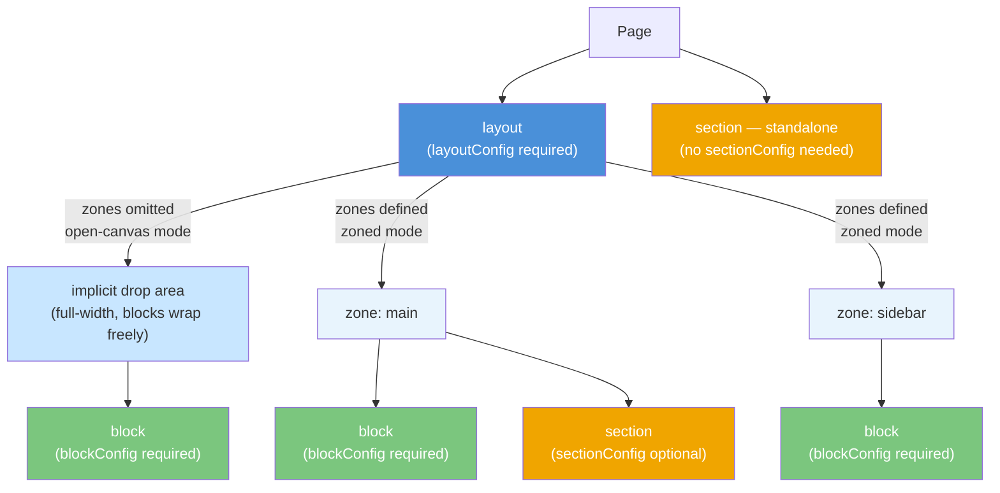
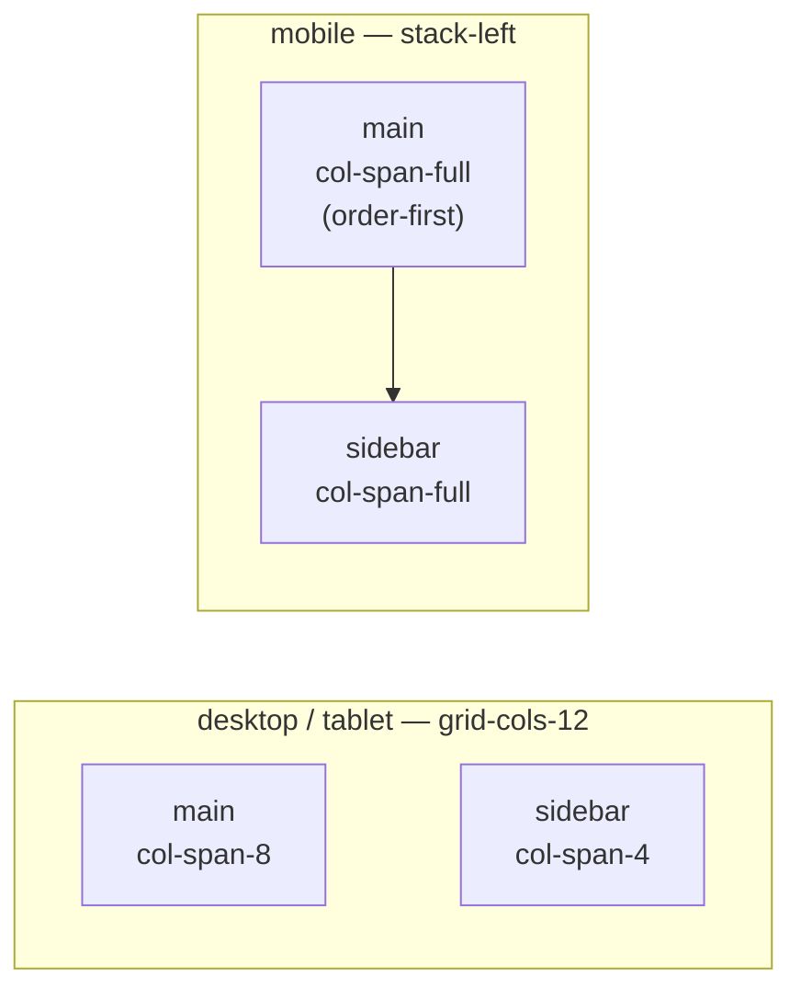
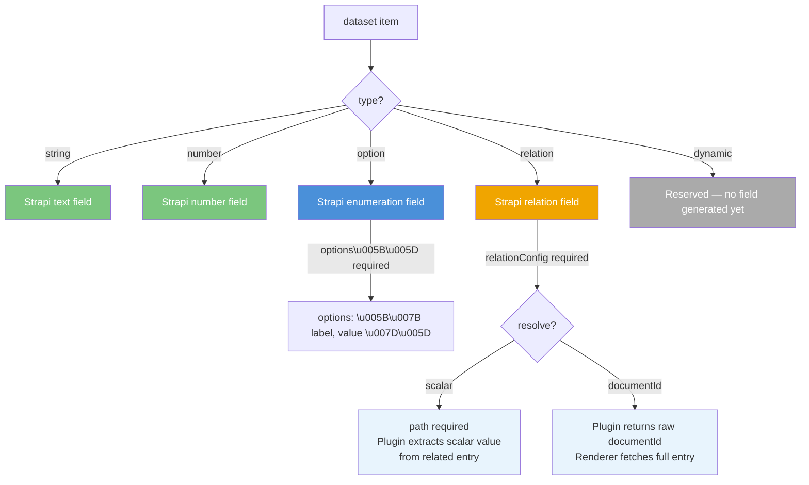

# Component Contract Schema — v0.0.1

A component contract is a JSON file that describes a frontend component to the sloth system. The sloth Strapi plugin reads contracts to auto-generate Strapi content-type fields, and the Puck editor reads them to render the admin UI.

**Canonical schema URL (use as `$schema`):**

```
https://phuhh98.github.io/sloth/schemas/component-contract/0.0.1/schema.json
```

See the [Schemas page](./schemas#component-contract) for the hosted link and versioning conventions.

---

## Minimal example

```json
{
  "$schema": "https://phuhh98.github.io/sloth/schemas/component-contract/0.0.1/schema.json",
  "name": "hero-banner",
  "label": "Hero Banner",
  "kind": "section",
  "schemaVersion": "0.0.1",
  "dataset": [
    {
      "key": "headline",
      "label": "Headline",
      "type": "string",
      "required": true
    }
  ]
}
```

---

## Top-level fields

### `$schema`

|          |          |
| -------- | -------- |
| Required | No       |
| Type     | `string` |

URL of the JSON Schema used for validation. Set this to the [hosted schema URL](https://phuhh98.github.io/sloth/schemas/component-contract/0.0.1/schema.json) to get IDE autocomplete and inline validation.

---

### `name`

|          |                                                            |
| -------- | ---------------------------------------------------------- |
| Required | Yes                                                        |
| Type     | `string` — kebab-case pattern `^[a-z0-9]+(?:-[a-z0-9]+)*$` |

Unique component identifier across the system. Used as the primary key in Strapi content-types and the Puck editor component palette.

```json
"name": "product-card"
```

---

### `label`

|          |                           |
| -------- | ------------------------- |
| Required | Yes                       |
| Type     | `string` — `minLength: 1` |

Human-readable name shown in the Puck editor's component drawer and in the Strapi admin UI.

---

### `kind`

|          |                                                         |
| -------- | ------------------------------------------------------- |
| Required | Yes                                                     |
| Type     | `string` — enum: `"layout"` \| `"section"` \| `"block"` |

Determines the structural role of the component:

| Value     | Description                                                                                                                                                                                                                               |
| --------- | ----------------------------------------------------------------------------------------------------------------------------------------------------------------------------------------------------------------------------------------- |
| `layout`  | Top-level container. Must have [`layoutConfig`](#layoutconfig). Two modes: **open-canvas** (no `zones`) — a single implicit drop area where blocks wrap freely; **zoned** (`zones` present) — named DropZones with declared column spans. |
| `section` | Full-width standalone component, or placed inside a layout zone with [`sectionConfig`](#sectionconfig).                                                                                                                                   |
| `block`   | Leaf component placed inside a layout zone (or an open-canvas layout). Must have [`blockConfig`](#blockconfig).                                                                                                                           |



---

### `schemaVersion`

|          |                  |
| -------- | ---------------- |
| Required | Yes              |
| Type     | `const: "0.0.1"` |

Contract format version. The schema file itself locks this to `"0.0.1"` — any other value fails validation. The plugin uses this to select the correct compatibility layer.

```json
"schemaVersion": "0.0.1"
```

:::tip
When the schema file sets `"default": "0.0.1"`, editors that support JSON Schema defaults will auto-insert this value for you.
:::

---

### `category`

|          |          |
| -------- | -------- |
| Required | No       |
| Type     | `string` |

Puck editor category for grouping components in the component drawer. Example: `"Content"`, `"Media"`, `"Navigation"`.

---

### `renderMeta`

|          |          |
| -------- | -------- |
| Required | No       |
| Type     | `object` |

Frontend-only metadata. The plugin ignores this field; the renderer uses it to mount the correct React component.

| Sub-field     | Required | Description                                                         |
| ------------- | -------- | ------------------------------------------------------------------- |
| `rendererKey` | Yes      | Key the frontend component map uses to look up the React component. |

```json
"renderMeta": {
  "rendererKey": "HeroBanner"
}
```

---

## `layoutConfig`

Required when `kind` is `"layout"`. Defines the 12-column Tailwind grid, optional full-width override, per-breakpoint responsive behaviour, and optionally named drop zones.

**Layout modes:**

| Mode            | How                                   | Behaviour                                                                                                                                                                                              |
| --------------- | ------------------------------------- | ------------------------------------------------------------------------------------------------------------------------------------------------------------------------------------------------------ |
| **Open-canvas** | Omit `zones`                          | Single implicit drop area spanning all columns. Blocks are placed freely and wrap automatically (Tailwind `flex-wrap` / grid auto-flow). Use for generic containers where placement order is flexible. |
| **Zoned**       | Provide `zones` array (`minItems: 1`) | One or more named Puck DropZones, each with a declared `span`. Blocks target a specific zone by its `key`.                                                                                             |

### `columns`

|          |                     |
| -------- | ------------------- |
| Required | Yes                 |
| Type     | `integer` — 1 to 12 |

Number of grid columns. Maps to Tailwind `grid-cols-{n}`.

### `fullWidth`

|          |           |
| -------- | --------- |
| Required | No        |
| Type     | `boolean` |

When `true`, the layout expands to full viewport width (`w-full`), ignoring the column grid. Use for `header` and `footer` layouts.

### `gap`

|          |                                                                  |
| -------- | ---------------------------------------------------------------- |
| Required | No                                                               |
| Type     | enum: `"none"` \| `"xs"` \| `"sm"` \| `"md"` \| `"lg"` \| `"xl"` |

Default gap between zones. Tailwind class mapping:

| Value  | Tailwind class | Size            |
| ------ | -------------- | --------------- |
| `none` | `gap-0`        | 0 px            |
| `xs`   | `gap-1`        | 4 px            |
| `sm`   | `gap-2`        | 8 px            |
| `md`   | `gap-4`        | 16 px (default) |
| `lg`   | `gap-6`        | 24 px           |
| `xl`   | `gap-8`        | 32 px           |

### `responsive`

Array of per-breakpoint override objects. Omit an entry to inherit the previous breakpoint's values (mobile-first).

Each item:

| Field        | Required | Description                                                                                             |
| ------------ | -------- | ------------------------------------------------------------------------------------------------------- |
| `breakpoint` | Yes      | `"mobile"` (< 768 px, no Tailwind prefix), `"tablet"` (≥ 768 px, `md:`), `"desktop"` (≥ 1280 px, `xl:`) |
| `behavior`   | Yes      | `"default"`, `"wrap"`, `"stack-left"`, or `"stack-right"` (see table below)                             |
| `columns`    | No       | Override column count at this breakpoint                                                                |
| `gap`        | No       | Override gap at this breakpoint                                                                         |

Behavior values:

| Value         | Effect                                                     |
| ------------- | ---------------------------------------------------------- |
| `default`     | Inherit previous breakpoint                                |
| `wrap`        | Zones wrap to next row when they don't fit                 |
| `stack-left`  | Leftmost zone lifts to top (`order-first / col-span-full`) |
| `stack-right` | Rightmost zone lifts to top (`order-last / col-span-full`) |

### `zones`

Optional. Named Puck DropZones with column-span assignments. **Omit entirely for open-canvas mode.** When present, must contain at least one entry (`minItems: 1`) — an empty array `[]` is not valid.

| Field  | Required | Description                                                              |
| ------ | -------- | ------------------------------------------------------------------------ |
| `key`  | Yes      | Free identifier, e.g. `"main"`, `"sidebar"`. Referenced by the renderer. |
| `span` | Yes      | Columns this zone occupies at default breakpoint (`col-span-{n}`)        |

The sum of spans should not exceed `columns`.

:::tip Open-canvas vs zoned
If your layout should accept any block without fixed columns (e.g. a 12-col free-form canvas), simply omit `zones`. The renderer will render one implicit DropZone and let blocks wrap across the full grid. Add `zones` only when you need distinct, independently addressable regions.
:::

**Example — 2-column layout with sidebar:**

```json
"layoutConfig": {
  "columns": 12,
  "gap": "md",
  "responsive": [
    { "breakpoint": "mobile", "behavior": "stack-left" },
    { "breakpoint": "tablet", "behavior": "default" }
  ],
  "zones": [
    { "key": "main", "span": 8 },
    { "key": "sidebar", "span": 4 }
  ]
}
```

What this looks like at each breakpoint:



---

## `blockConfig`

Required when `kind` is `"block"`. Defines how many columns and rows the block occupies within its parent zone.

Zone stacking and reordering is controlled by the parent layout's [`layoutConfig.responsive`](#responsive) — blocks do not repeat it.

| Field        | Required | Description                                                        |
| ------------ | -------- | ------------------------------------------------------------------ |
| `colSpan`    | Yes      | Columns occupied in parent zone (`col-span-{n}`)                   |
| `rowSpan`    | No       | Rows spanned (`row-span-{n}`). Omit to wrap naturally.             |
| `responsive` | No       | Array of `{ breakpoint (required), colSpan?, rowSpan? }` overrides |

**Example:**

```json
"blockConfig": {
  "colSpan": 6,
  "responsive": [
    { "breakpoint": "mobile", "colSpan": 12 },
    { "breakpoint": "tablet", "colSpan": 6 }
  ]
}
```

---

## `sectionConfig`

Optional. Provide only when the section is placed inside a layout zone so the renderer knows its column width. Omit entirely for standalone full-width sections (the renderer defaults to `col-span-full`).

| Field        | Required         | Description                                              |
| ------------ | ---------------- | -------------------------------------------------------- |
| `colSpan`    | Yes (if present) | Columns in the parent zone (`col-span-{n}`)              |
| `responsive` | No               | Array of `{ breakpoint (required), colSpan? }` overrides |

---

## `dataset`

Required. Array of data field definitions that the plugin generates as Strapi fields. Must have at least one item.



Each item:

| Field            | Required               | Description                                                                                  |
| ---------------- | ---------------------- | -------------------------------------------------------------------------------------------- |
| `key`            | Yes                    | Field identifier (`^[a-zA-Z][a-zA-Z0-9_]*$`). Becomes the key in the flat page response map. |
| `label`          | Yes                    | Human-readable label in the Strapi admin UI and Puck editor.                                 |
| `type`           | Yes                    | One of `"string"`, `"number"`, `"option"`, `"relation"`, `"dynamic"`                         |
| `required`       | No                     | When `true`, Strapi marks the field required.                                                |
| `value`          | No                     | Default value pre-populated in the Puck editor.                                              |
| `options`        | Conditionally required | Required when `type` is `"option"`. Array of `{ label, value }`.                             |
| `relationConfig` | Conditionally required | Required when `type` is `"relation"`. See below.                                             |

### `type` values

| Value      | Strapi field generated | Description                           |
| ---------- | ---------------------- | ------------------------------------- |
| `string`   | Text field             | Free-form text                        |
| `number`   | Number field           | Numeric input                         |
| `option`   | Enumeration field      | Dropdown from `options[]`             |
| `relation` | Relation field         | References content-type entries       |
| `dynamic`  | TBD                    | Reserved for future dynamic rendering |

### `options` (for `type: "option"`)

```json
{
  "key": "size",
  "label": "Size",
  "type": "option",
  "options": [
    { "label": "Small", "value": "sm" },
    { "label": "Medium", "value": "md" },
    { "label": "Large", "value": "lg" }
  ]
}
```

### `relationConfig` (for `type: "relation"`)

| Field         | Required               | Description                                                                                      |
| ------------- | ---------------------- | ------------------------------------------------------------------------------------------------ |
| `contentType` | Yes                    | Strapi content-type UID, e.g. `"api::article.article"`                                           |
| `resolve`     | Yes                    | `"scalar"` or `"documentId"` (see below)                                                         |
| `path`        | Conditionally required | Required when `resolve` is `"scalar"`. Dot-notation path to a scalar field on the related entry. |
| `multiple`    | No                     | `true` to return an array of values instead of a single value.                                   |

**Resolution modes:**

```mermaid
flowchart LR
    CF["Contract field\ntype: relation"] --> RC["relationConfig"]
    RC --> RQ{"resolve"}

    RQ --> |"scalar"| SP["path required\ne.g. 'title'"]
    SP --> SV["Plugin extracts\nrelatedEntry.title"]
    SV --> SM{"multiple?"}
    SM --> |"false"| SS["flat map value:\n\"My Article Title\""]
    SM --> |"true"| SA["flat map value:\n[\"Title A\", \"Title B\"]"]

    RQ --> |"documentId"| DV["Plugin returns\nrelatedEntry.documentId"]
    DV --> DM{"multiple?"}
    DM --> |"false"| DS["flat map value:\n\"abc123\""]
    DM --> |"true"| DA["flat map value:\n[\"abc123\", \"def456\"]"]

    style SP fill:#e8f4fd,color:#333
    style DV fill:#e8f4fd,color:#333
    style SS fill:#7bc67e,color:#fff
    style SA fill:#7bc67e,color:#fff
    style DS fill:#f0a500,color:#fff
    style DA fill:#f0a500,color:#fff
```

| `resolve`    | What the flat map value contains                                                                                             |
| ------------ | ---------------------------------------------------------------------------------------------------------------------------- |
| `scalar`     | The value at `path` extracted from the related entry, e.g. `"My Article Title"`. Array of values when `multiple: true`.      |
| `documentId` | The raw Strapi `documentId` string. Renderer is responsible for fetching the full entry. Array of IDs when `multiple: true`. |

**Scalar example** — extract the title of a related article:

```json
{
  "key": "featuredArticle",
  "label": "Featured Article",
  "type": "relation",
  "relationConfig": {
    "contentType": "api::article.article",
    "resolve": "scalar",
    "path": "title"
  }
}
```

**documentId example** — pass the ID, let the renderer fetch the rest:

```json
{
  "key": "relatedProducts",
  "label": "Related Products",
  "type": "relation",
  "relationConfig": {
    "contentType": "api::product.product",
    "resolve": "documentId",
    "multiple": true
  }
}
```

---

## Full example — open-canvas layout

A 12-column layout where blocks are placed freely without named zones:

```json
{
  "$schema": "https://phuhh98.github.io/sloth/schemas/component-contract/0.0.1/schema.json",
  "name": "free-canvas",
  "label": "Free Canvas",
  "kind": "layout",
  "schemaVersion": "0.0.1",
  "category": "Layout",
  "layoutConfig": {
    "columns": 12,
    "gap": "md",
    "responsive": [
      { "breakpoint": "mobile", "behavior": "wrap" },
      { "breakpoint": "tablet", "behavior": "default" }
    ]
  },
  "dataset": [{ "key": "title", "label": "Section Title", "type": "string" }],
  "renderMeta": {
    "rendererKey": "FreeCanvas"
  }
}
```

---

## Full example — layout with two zones

```json
{
  "$schema": "https://phuhh98.github.io/sloth/schemas/component-contract/0.0.1/schema.json",
  "name": "two-col-layout",
  "label": "Two Column Layout",
  "kind": "layout",
  "schemaVersion": "0.0.1",
  "category": "Layout",
  "layoutConfig": {
    "columns": 12,
    "gap": "md",
    "responsive": [
      { "breakpoint": "mobile", "behavior": "stack-left" },
      { "breakpoint": "tablet", "behavior": "default" }
    ],
    "zones": [
      { "key": "main", "span": 8 },
      { "key": "sidebar", "span": 4 }
    ]
  },
  "dataset": [{ "key": "title", "label": "Section Title", "type": "string" }],
  "renderMeta": {
    "rendererKey": "TwoColLayout"
  }
}
```

## Full example — block component

```json
{
  "$schema": "https://phuhh98.github.io/sloth/schemas/component-contract/0.0.1/schema.json",
  "name": "article-teaser",
  "label": "Article Teaser",
  "kind": "block",
  "schemaVersion": "0.0.1",
  "category": "Content",
  "blockConfig": {
    "colSpan": 4,
    "responsive": [
      { "breakpoint": "mobile", "colSpan": 12 },
      { "breakpoint": "tablet", "colSpan": 6 },
      { "breakpoint": "desktop", "colSpan": 4 }
    ]
  },
  "dataset": [
    { "key": "title", "label": "Title", "type": "string", "required": true },
    {
      "key": "category",
      "label": "Category",
      "type": "option",
      "options": [
        { "label": "News", "value": "news" },
        { "label": "Tech", "value": "tech" }
      ]
    },
    {
      "key": "article",
      "label": "Article",
      "type": "relation",
      "relationConfig": {
        "contentType": "api::article.article",
        "resolve": "scalar",
        "path": "slug"
      }
    }
  ],
  "renderMeta": {
    "rendererKey": "ArticleTeaser"
  }
}
```

---

## Validate with the CLI

```bash
sloth contracts verify --file ./my-component.json --version 0.0.1
```

See [CLI Command Reference](./cli-contract#verification-rules) for exit codes and error types.
