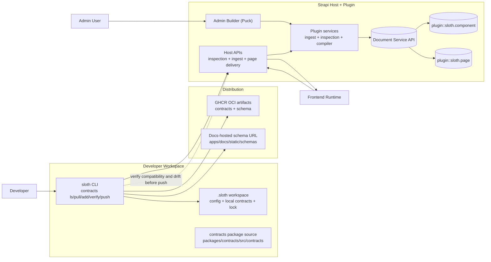

# Architecture

This page describes how the major pieces of sloth fit together at a high level.

## System Diagram

## Contract Source and Versioning

- Canonical contract source lives in `packages/contracts/src/contracts`.
- Canonical schema source lives in `packages/contracts/src/schemas`.
- Release artifacts are published to GHCR as OCI artifacts.
- Docs-hosted schema URLs remain canonical `$schema` endpoints for validators/editors.

## Actors

**Admin User** — uses the Puck drag-and-drop builder embedded in the Strapi admin panel to compose page templates from available component slots and bind them to CMS content.

**Developer** — uses the sloth CLI to pull/list contracts from OCI artifacts, validate contracts, and push to a Strapi host.

**Frontend Runtime Consumer** — a frontend application (Next.js, Nuxt, etc.) that fetches page delivery payloads from the Strapi Content API and renders them using its own component implementations.

## Responsibility Boundaries

| Layer                                              | Owned By                                 |
| -------------------------------------------------- | ---------------------------------------- |
| Content-types (`component`, `page`)                | Strapi plugin                            |
| Contract ingestion and validation                  | Plugin services (ingest + inspection)    |
| Page composition UI                                | Admin UI (Puck builder)                  |
| Page compilation (`puckConfig` → `compiledConfig`) | Plugin compiler service                  |
| Contract authoring and local validation            | sloth CLI                                |
| Contract source and release tooling                | contracts package (`packages/contracts`) |
| OCI artifact distribution                          | GHCR                                     |
| Public schema artifacts (`$schema` URL)            | This documentation site                  |
| Reusable component variants                        | Component Hub (future)                   |
| Public/private registry                            | Registry API (future)                    |

## Data Flow: Contract Ingestion

1. Developer authors a contract in YAML/JSON locally.
2. CLI validates the contract against schema compatibility constraints.
3. CLI pushes the validated payload to the host ingest endpoint.
4. Plugin ingestion service normalizes and writes a `component` record via the Document Service API.
5. The Admin UI reflects the new component in the builder palette.

## Data Flow: Page Delivery

1. Frontend runtime requests a page by document ID from the Content API.
2. Plugin returns the page record including its compiled component config and bound content references.
3. Frontend resolves component slots using its own renderer registry keyed by `rendererKey`.
