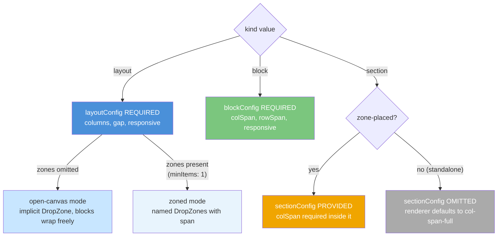
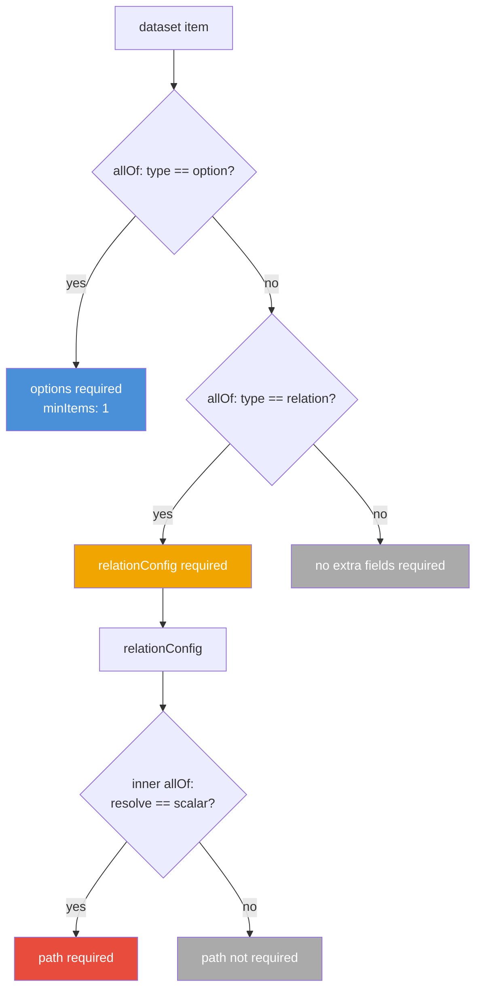

# Contract Schema v0.0.1 — Implementation Notes

This page documents the design decisions made in contract schema v0.0.1 and the implementation requirements for the Strapi plugin and CLI. Intended for contributors working on the plugin, compiler, or CLI internals.

For the user-facing field reference, see [Component Contract Schema](../consumers/component-contract-schema).

---

## Schema file location

| Purpose                            | Path                                                                  |
| ---------------------------------- | --------------------------------------------------------------------- |
| Canonical source                   | `packages/contracts/src/schemas/component-contract/0.0.1/schema.json` |
| Docs-hosted (public `$schema` URL) | `apps/docs/static/schemas/component-contract/0.0.1/schema.json`       |
| Working draft (notebook)           | `notebooks/component-contract.json`                                   |

The docs-hosted URL is the canonical `$schema` endpoint. Validators, editors, and the CLI schema version check all point here.

---

## Version locking via `const`

`schemaVersion` uses `"const": "0.0.1"` instead of a free `type: string`. This means:

- Any value other than `"0.0.1"` fails JSON Schema validation outright — no extra plugin-side version string comparison needed at the validation layer.
- `"default": "0.0.1"` allows editors (VS Code, etc.) to auto-insert the field.
- When a new schema version ships, the new schema file gets its own `const` value. Old files validated against the old schema continue to work. The plugin selects the schema version to validate against based on the contract's `$schema` URL.

**Plugin responsibility:** detect the `$schema` URL in incoming contracts and route to the correct validator. Do not hardcode a single version in the validator; keep per-version schemas as discrete validation units.

---

## `kind` → config pairing (enforced by `allOf if/then`)

The top-level `allOf` enforces:

| `kind`      | Required config                                                         |
| ----------- | ----------------------------------------------------------------------- |
| `"layout"`  | `layoutConfig` — two modes: **open-canvas** (`zones` omitted) or **zoned** (`zones` present, `minItems: 1`) |
| `"block"`   | `blockConfig`                                                           |
| `"section"` | `sectionConfig` optional — omit for standalone, provide for zone-placed |



`sectionConfig` is intentionally optional. When absent, the renderer must default the section to `col-span-full`. When present, `colSpan` is required inside it (enforced by `sectionConfig.required`).

**Open-canvas vs zoned:** The renderer must detect which mode is active by checking whether `layoutConfig.zones` is present. When absent, render a single unnamed Puck DropZone spanning `col-span-full`. When present (guaranteed `minItems: 1`), render one named DropZone per entry.

---

## `dataset` enforcement

Two `allOf if/then` rules inside `dataset.items` enforce conditional required fields:

| `type` value | Required field                   |
| ------------ | -------------------------------- |
| `"option"`   | `options` (array, `minItems: 1`) |
| `"relation"` | `relationConfig`                 |

A third inner `allOf` inside `relationConfig` enforces:

| `resolve` value | Required field |
| --------------- | -------------- |
| `"scalar"`      | `path`         |



:::warning Inline rules
These rules live directly in `dataset.items.allOf` and `relationConfig.allOf`. Do **not** move them to `$defs` without a matching `$ref` — orphaned `$defs` are silently ignored by validators.
:::

---

## Strapi field generation mapping

The plugin must read each `dataset` item and create a corresponding Strapi component field:

| `type`     | Strapi field type | Notes                                                                                                                                                           |
| ---------- | ----------------- | --------------------------------------------------------------------------------------------------------------------------------------------------------------- |
| `string`   | `text`            | Free-form. Map `required: true` → Strapi `required` constraint.                                                                                                 |
| `number`   | `number`          | Map `required: true` → Strapi `required` constraint.                                                                                                            |
| `option`   | `enumeration`     | Use `options[].value` as the enum values. `options[].label` is admin-UI-only metadata.                                                                          |
| `relation` | `relation`        | Use `relationConfig.contentType` as the target content-type. `multiple: true` → `manyToMany` or `oneToMany` depending on design; `false/omitted` → `manyToOne`. |
| `dynamic`  | TBD               | Reserved — do not generate Strapi fields for this type yet.                                                                                                     |

---

## Page response flat map

When the plugin serializes a composed page for the Content API, each `dataset` key becomes a top-level key in the component's flat map object.

```mermaid
flowchart LR
    subgraph contract["Contract (dataset)"]
        F1["key: headline\ntype: string"]
        F2["key: category\ntype: option"]
        F3["key: article\ntype: relation\nresolve: scalar, path: title"]
        F4["key: relatedId\ntype: relation\nresolve: documentId"]
    end
    subgraph strapi["Strapi (plugin serializes)"]
        S1["Reads stored text value"]
        S2["Reads stored enum value"]
        S3["Fetches related entry\nextracts .title field"]
        S4["Fetches related entry\nreturns .documentId"]
    end
    subgraph flatmap["Page response flat map"]
        R1["{headline: \"Buy Now\"}"]
        R2["{category: \"news\"}"]
        R3["{article: \"My Article Title\"}"]
        R4["{relatedId: \"abc123\"}"]
    end
    F1 --> S1 --> R1
    F2 --> S2 --> R2
    F3 --> S3 --> R3
    F4 --> S4 --> R4
```

For `type: "relation"`:

- `resolve: "scalar"` + `path: "title"` → value is the string at `relatedEntry.title` (or array of strings if `multiple: true`)
- `resolve: "documentId"` → value is `relatedEntry.documentId` string (or array if `multiple: true`)

The renderer receives the flat map and is responsible for:

- Using scalar values directly
- Fetching full entries by `documentId` when `resolve` is `"documentId"`

---

## Grid / layout implementation — Tailwind class reference

The plugin generates layout metadata but does **not** emit Tailwind classes. The renderer reads `layoutConfig` / `blockConfig` / `sectionConfig` and applies classes.

| Schema value                         | Tailwind class                  | Notes                                                                              |
| ------------------------------------ | ------------------------------- | ---------------------------------------------------------------------------------- |
| `layoutConfig.columns: n`            | `grid-cols-{n}`                 | Applied to the layout container                                                    |
| `layoutConfig.fullWidth: true`       | `w-full`                        | Overrides grid, no column class emitted                                            |
| `layoutConfig.gap: "md"`             | `gap-4`                         | See full mapping in [schema reference](../consumers/component-contract-schema#gap) |
| `layoutConfig.zones` absent          | single `col-span-full` DropZone | Open-canvas mode — renderer creates one implicit drop area                         |
| `zones[].span: n`                    | `col-span-{n}`                  | Applied to each named zone element (zoned mode only)                               |
| `blockConfig.colSpan: n`             | `col-span-{n}`                  | Applied to the block element                                                       |
| `blockConfig.rowSpan: n`             | `row-span-{n}`                  | Applied to the block element                                                       |
| `responsive[].breakpoint: "tablet"`  | `md:` prefix                    | Prepended to responsive overrides                                                  |
| `responsive[].breakpoint: "desktop"` | `xl:` prefix                    | Prepended to responsive overrides                                                  |
| `behavior: "stack-left"`             | `order-first col-span-full`     | Applied to leftmost zone at that breakpoint                                        |
| `behavior: "stack-right"`            | `order-last col-span-full`      | Applied to rightmost zone at that breakpoint                                       |
| `behavior: "wrap"`                   | `flex-wrap` or grid `auto-flow` | Zones wrap to next row; also the default for open-canvas layouts                   |

---

## `renderMeta.rendererKey`

The plugin stores this value in the persisted component record. The frontend renderer uses it as a lookup key into the registered component map. The plugin has no opinion on what this key resolves to — it is pure frontend contract.

Validation: the plugin should warn (not error) if `renderMeta` is absent, since it is optional in the schema. A component without `renderMeta.rendererKey` will silently fall back to whatever the renderer's default behavior is.

---

## Known limitations / future work

| Item                                 | Notes                                                                                                                      |
| ------------------------------------ | -------------------------------------------------------------------------------------------------------------------------- |
| `type: "dynamic"`                    | Not yet specified. The schema reserves the value; the plugin must skip field generation for it.                            |
| `sectionConfig` responsive `colSpan` | Only single-dimension responsive (colSpan). Behavior overrides are inherited from the parent layout — this is intentional. |
| Schema version routing               | The plugin must maintain a registry of known schema versions and their validators. v0.0.1 is the first entry.              |
| No `$defs`                           | All conditional rules are inlined. Keep this pattern — orphaned `$defs` are a silent failure mode.                         |
