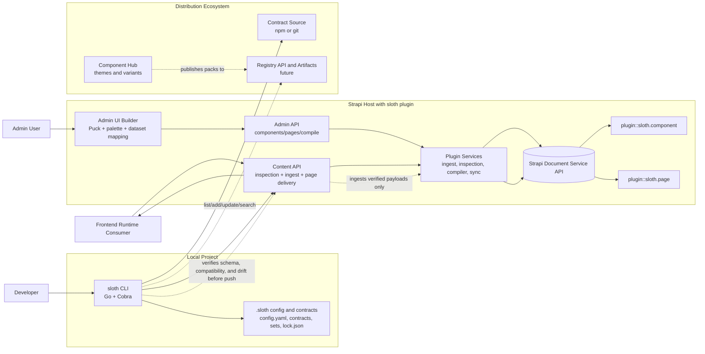

# sloth Architecture Design Diagram

Date: 2026-05-10
Source of truth: docs/IDEAS.md

## High-Level System Architecture

## Responsibility Boundaries

- CLI owns verification workflow before push.
- Host plugin owns ingest and materialization into component records.
- Runtime delivery endpoint serves page delivery payload and first-level linked content strategy.
- Registry and component hub are later roadmap phases and remain decoupled from core plugin and CLI MVP.

## Architecture Notes

- Keep architecture as a modular monolith around Strapi plugin and CLI during Milestones 1 and 2.
- Add registry complexity incrementally after stable plugin and CLI contracts are proven.
- Keep runtime API generic and avoid deep linked-data parsing in plugin runtime.
